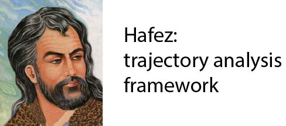

README
================
2025-02-28

Hafez is a time-series analysis framework the performs landmark
trajectory inference and trajectory analysis strategies including cell
density-based pseudotime normalization (DBPB), time-series distance
(TSD) clustering, and post-trajectory analysis methods that leverage the
landmark framework.
