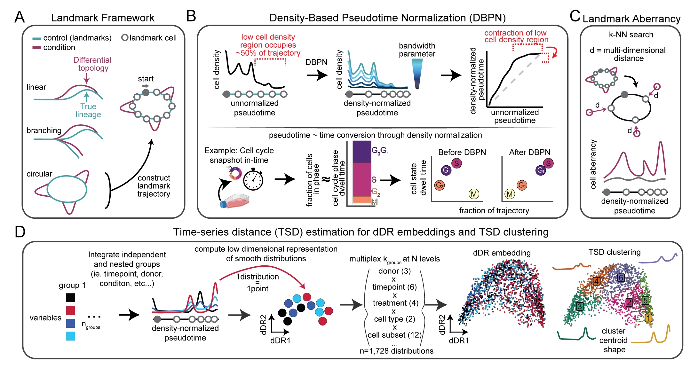

README
================
2025-02-28

<figure>

<figcaption aria-hidden="true">macOS Build</figcaption>
</figure>

“Hafez” is a time-series analysis framework the performs landmark
trajectory inference and trajectory analysis strategies including cell
density-based pseudotime normalization (DBPN), time-series distance
(TSD) clustering, and post-trajectory analysis methods that leverage the
landmark framework to study dynamic biological process through the lens
of normal, healthy progression. It is fast, extensible, and
generalizable to different single-cell omics and systems.



The name, Hafez, is inspired by the 14th century Persian poet whose
collected works are regarded as some of the greatest achievements in
Iranian literature. It is tradition to delve into the mysteries of fate
and destiny through “faal-e-Hafez’’ (divination) when faced with
challenges, choice, questions, or for entertainment. Hafez’s poetry
intends to reveal our fate or destiny during transitions in life,
drawing parallels to the field of single-cell trajectory inference that
maps cell fate and reveals cell state transitions. The word Hafez
literally translates to”one who remembers” or “keeps in memory” - which
is fitting considering cell fate mechanisms are often encoded earlier in
differentiation and remembered as cells meet their destiny. Hafez often
ponders the interconnectedness of human actions (experimental) and
cosmic forces (computational) to interpret the world, so we pay homage
to his legacy by naming our integrated experimental and computational
method for interpretable landmark trajectory inference and systems
modeling, Hafez.

## Quick Install

**macOS users: install gfortran first** (required to compile two dependencies — takes ~2 min):

1. Download and run the installer from https://mac.r-project.org/tools/ (choose the arm64 or x86 `.pkg` depending on your Mac).

2. Then in R:

```r
# install.packages("remotes")
remotes::install_github("mamouzgar/hafez", build_vignettes = FALSE)
```

That's it — all other dependencies (including `ElPiGraph.R`, `distutils`, and `dtwclust`) are installed automatically.

> **Linux / Windows:** gfortran is typically available by default. Just run the `remotes::install_github(...)` command above.
>
> **Still seeing compiler errors?** See the full [macOS troubleshooting](#1-standard-github-installation-using-devtools-in-r) section below.

## Installation

There are a few options for using Hafez.

1)  Github-based installation in R.

2)  Docker image.

3)  hafezjoon - A miniature version of Hafez that has all the
    post-trajectory inference functionality but omits the trajectory
    inference algorithm, which significantly simplifies installation.

Example code to run the different functions are available with example
data in ExampleCode/example_code.R. Install the package and follow the
instructions in ExampleCode/example_code.R.

## (1) Standard Github installation using devtools in R.

It is highly recommended to use conda environments and reticulate for
Hafez to avoid conflicts and secure your environment. We provide an
`environment.yml` file that creates a conda environment with the
necessary base software.

Based on this recommended, please either download the
“./installation_resources/environment.yml” file or clone the Hafez repo.
Then follow these instructions:

1.  Install gfortran for macOS. R on macOS requires gfortran from the
    official CRAN toolchain (not `brew install gcc` — that puts gfortran
    in the wrong location). Download the `.pkg` installer for your architecture
    from <https://mac.r-project.org/tools/> and run it.
    Optionally, install other system libraries via Homebrew:

``` bash
brew install pkg-config icu4c udunits
export PKG_CONFIG_PATH="/opt/homebrew/opt/icu4c/lib/pkgconfig"
```

2.  Run this conda command.

``` bash
conda env create --no-default-packages -f ~/Downloads/environment.yml ## or directly from the github package
conda activate hafez_env
pip install hafezR
```

3.  Open Rstudio and install these R packages if you don’t have them.

``` r
# List of required packages
required_packages <- c("remotes", "reticulate")

# Check and install any that are missing
installed <- required_packages %in% rownames(installed.packages())
if (any(!installed)) {
  install.packages(required_packages[!installed])
}
```

4.  Then activate the conda environment using reticulate and install
    Hafez. It might take some time to install all the dependencies!

``` r
reticulate::use_condaenv('hafez_env')

remotes::install_github("mamouzgar/hafez", build_vignettes = FALSE,force = TRUE)
```

**Troubleshooting gfortran errors:** R on macOS links against gfortran
even for C++ packages. The fix is to install the official CRAN gfortran
toolchain (not `brew install gcc`) from <https://mac.r-project.org/tools/>.
This installs to `/opt/gfortran/`, which is exactly where R looks for it.
After installing, retry the `remotes::install_github(...)` command above.

``` r
remotes::install_github("mamouzgar/hafez", build_vignettes = FALSE, force = TRUE)
```

## (2) Docker image.

A dockerfile is present in this repository. Follow the instructions
below to download Docker desktop to your machine and run the Docker
image:

1.  Install Docker: <https://docs.docker.com/desktop/>

2.  Open terminal and clone the github repository.

``` r
git clone https://github.com/mamouzgar/hafez.git
```

3.  Navigate to the directory and build the docker image. This may take
    ~20-30 minutes

``` r
cd hafez
docker build -t hafez_docker .
```

4.  Run the docker image. You can change the port and password as you
    wish. I highly recommend you mount a local directory to the docker
    container to have access to local data and save your results. In
    this example, I use the -v command to mount a local directory called
    `~/Rpackages/hafez/data` in the hafez repo to the
    `/home/rstudio/data` directory in the docker container. Here, files
    saved in `/home/rstudio/data/` of the docker environment will live
    on the host machine path you provided (i.e.,
    `~/Rpackages/hafez/data`) so your files will be saved on the host
    machine even if the container is deleted.

``` bash
docker run -d \
    -p 8787:8787 \
    -e PASSWORD=hafez \
    -v ~/Rpackages/hafez/data:/home/rstudio/data \ 
    hafez_docker
```

4.  Open <http://localhost:8787> in your browser.

5.  Login with:

``` bash
Username: hafez
Password: hafez # or other password you specified. You might see a warning message when logging in.
```

6.  You can now run Hafez from within the docker image. See the example
    code instructions at the top of the repo.

7.  You can stop the docker image by running:

``` bash
docker stop <container_id>
docker rm <container_id>
```

I recommend reading about docker and how to use it!

## (3) hafezjoon

Hafez includes both trajectory inference and post-hoc trajectory
analysis functionality. However, you may only be interested in the
analysis toolkit if you’ve used another preferred trajectory inference
strategy. Considering the trajectory inference functionality is hefty,
we’ve provided a simpler version of the package with a simpler
installation procedure. This miniature version of Hafez that has all the
post-trajectory inference functionality but omits the trajectory
inference algorithm.

To install hafezjoon, you can go to the github page
<https://github.com/mamouzgar/hafezjoon> or directly install in R using
the following command:

``` r
remotes::install_github("mamouzgar/hafezjoon", build_vignettes = FALSE,force = TRUE)
```

You may need to manually install some dependencies.
